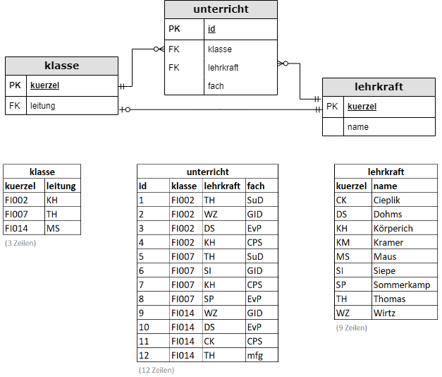

# gsoDB
Dieses Repository enthält eine Beispieldatenbank zur Erarbeitung von SQL-Kenntnissen.

## Vorbereitungen :rocket:
- Für die Arbeit mit SQLite empfehle ich den [DB Browser for SQLite](https://sqlitebrowser.org/).
- Um die Datenbank zu erstellen, muss :page_with_curl: [gsoDb_CREATE_Sqlite.sql](https://github.com/gsoTH/gsoDB/blob/main/gsoDb_CREATE_Sqlite.sql) ausgeführt werden. 
- Es gibt auch ein Fiddle in dem [exemplarische Abfragen](https://www.db-fiddle.com/f/4nYLMcZUJD4E94rWvASeKu/0) durchgeführt werden können.

### Schema
Das Modell des Schemas ist in der [Krähenfussnotation](https://de.wikipedia.org/wiki/Martin-Notation) dargestellt. [:tv: Erklärung](https://web.microsoftstream.com/video/1e2429e0-e25f-4215-b57c-4eb640e2d6e3)

## Abfragen (DQL)
Alle :page_with_curl:Skripte liegen im Ordner [Abfragen](https://github.com/gsoTH/gsoDB/tree/main/Abfragen).

Hier sind einige Erklärungen:
- :tv: für [GROUP BY (+Having)](https://web.microsoftstream.com/video/b4babfb5-e806-4178-bfd3-913b779b9858)
- :tv:
[Ein besseres Beispiel für das Filtern bei GROUP BY](https://web.microsoftstream.com/video/eebca250-7cfe-4f88-9b0b-c235dc566d8f)
- :tv: ["Natürliches JOIN" und Inner Join](https://web.microsoftstream.com/video/ecf257e0-5c74-4feb-a04b-6445f60a1e7f)

